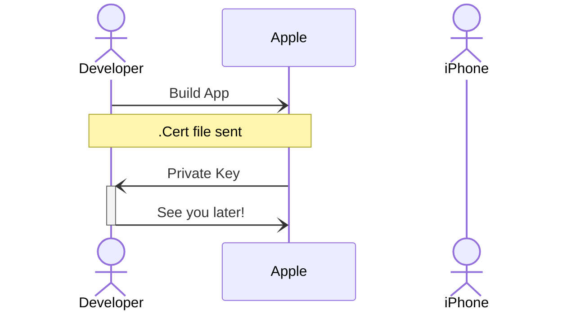
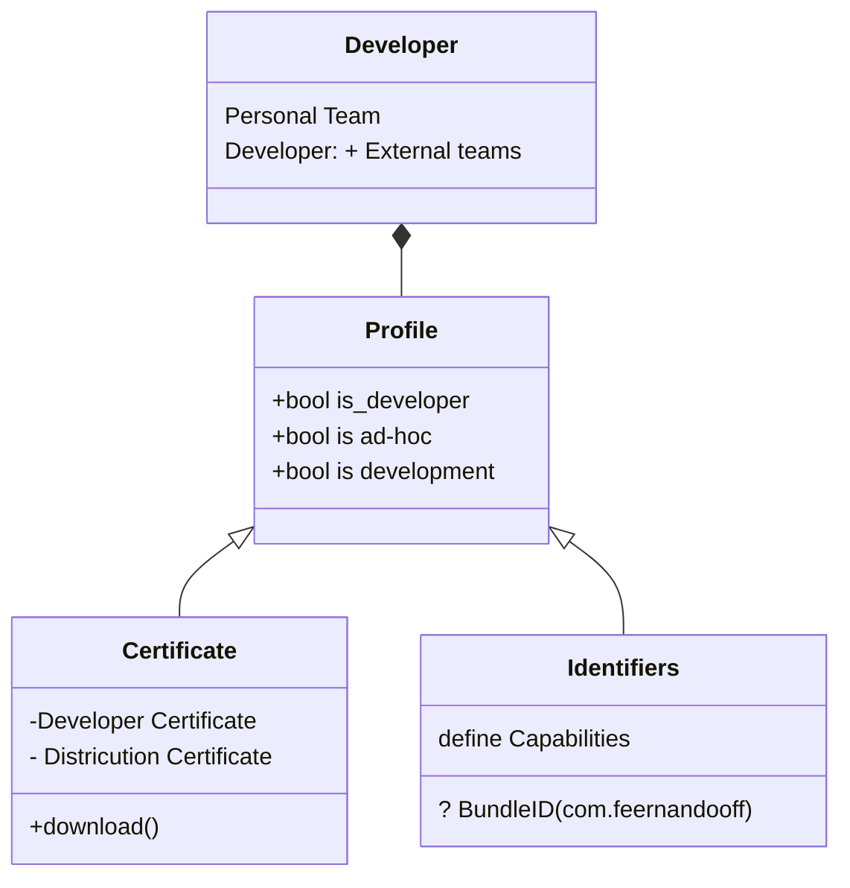

---
{"dg-publish":true,"permalink":"/zettelkasten/apple-certificates/","title":"Apple Certificates","tags":["status/todo","core/tech/ios"],"created":"2023-11-13T17:08:28.523+00:00"}
---

# Apple Certificates

> iOS is a **propietary** system and certificates are a way to validate *who* you hare and verify that you have the rights to do it.

The purpose of the certificates is to allow Apple know that you're allowed to do what you're trying to do.

### Developer Certificates

## Relates to
- [[The ‘What’ and ‘Why’ of iOS Signing Certificates and Provisioning Profiles — And How to Manage Them as Your Team Grows\|The ‘What’ and ‘Why’ of iOS Signing Certificates and Provisioning Profiles — And How to Manage Them as Your Team Grows]]
## References
