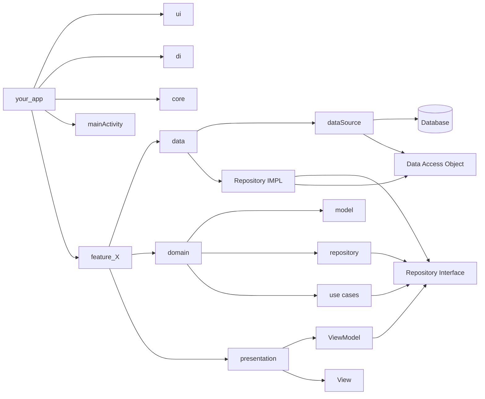

---
{"dg-publish":true,"permalink":"/zettelkasten/clean-architecture/","title":"App architecture","tags":["status/todo","core/tech"],"dgHomeLink":"false","dgShowBacklinks":"false","dgShowLocalGraph":"false","dgEnableSearch":"false","dgShowTags":"false","noteIcon":"","created":"2023-10-11T10:29:59.521+01:00"}
---

# Clean Architecture

## What does it solves?

## Core principles

Unidirectional flow
Separation of conserns
 unidirectional flow
- data layer unit tested
- ui sends triggers events callbacks and data layer updates the data that the UI reacts to
## Benefits
## Implementation

---
### Concepts
#### Presentation layer
> [See video](https://youtu.be/p9VR8KbmzEE)

#### Domain layer

###### Model
Defines the values that a data model has

###### Repository
Handles multiple data sources (multiple) and determine which one to use in different moments. i.e API and local database

- Interface  that exposes methods for accessing data from whatever datasource
###### Use case
> What in [[Zettelkasten/MVVM\|MVVM]] you do in the viewModel now is a **use case**, allowing you to re-use methods
> Contains the **Business Logic**

This gets inserted in the viewModel as a dependency

Uses repository (from whichever source is comming) and handles the **business logic inside** it

#### Data layer
###### Repository implementation
Implements the repository interface created in the [[Zettelkasten/Clean Architecture#Domain layer\|#Domain layer]] under the 

> You can implement interfaces with CTRL + I and CTRL+A to implement all methods of an interface
###### Data source

#### Multi module architecture
>No main layers in the root

Divide code by **features** (one or more screens)
> Each feature has his own layers (Presentation, Domain and data )
> Do **not** name your folders related to the library, i.e instead of okhttp2 call it API

---
#### Implementation chart

#### Implementation for different platforms

##### Clean Architecture for iOS
##### Clean Architecture for Android
##### Clean Architecture for Web

## Relates to
[[Readwise/Articles/Why (And How) You Should Use Feature-Driven Development\|Why (And How) You Should Use Feature-Driven Development]]
[Guide app architecture](https://developer.android.com/topic/architecture)
## References
