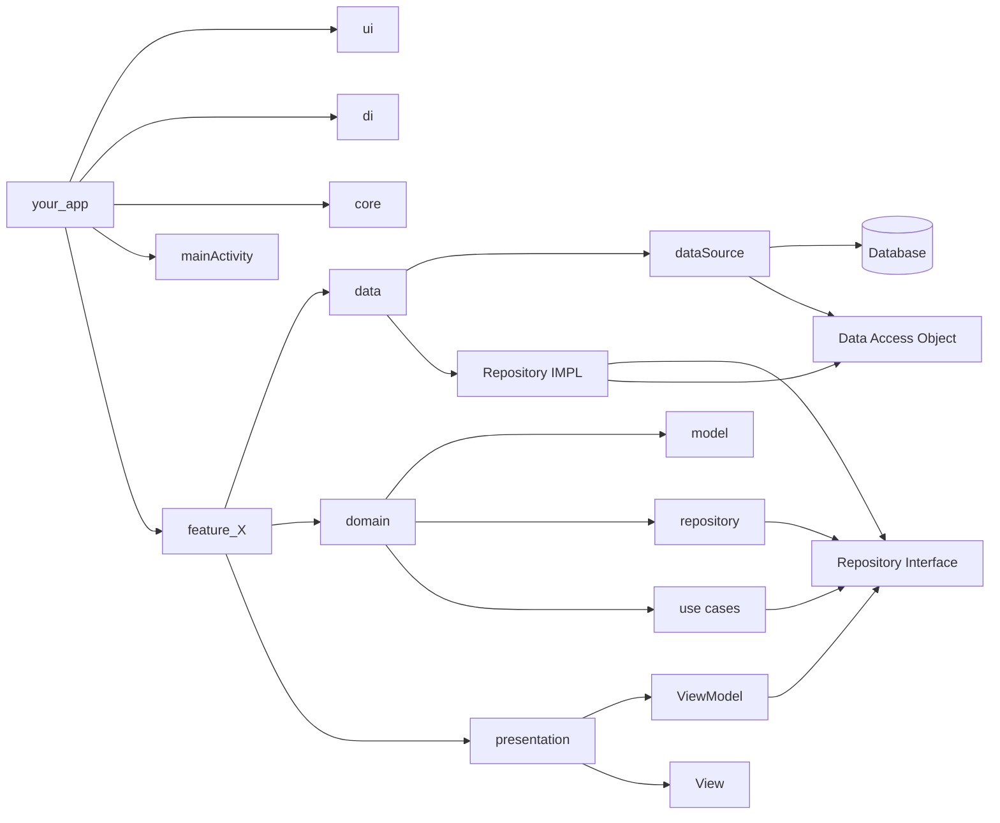

---
{"dg-publish":true,"permalink":"/zettelkasten/clean-architecture/","title":"App architecture","tags":["status/todo","core/tech"],"dgHomeLink":"false","dgShowBacklinks":"false","dgShowLocalGraph":"false","dgEnableSearch":"false","dgShowTags":"false","noteIcon":"","created":"2023-10-11T10:29:59.521+01:00"}
---

# Clean Architecture

## What is Clean architecture?

Clean architecture is a **set of designs principles** that allow  a separation of software into layers, the main idea is that dependencies should **go from outer layers to inner layers**.

## What does it solves?

Clean architecture provides guidelines that allows to solve common issues of the software industry, like:
- Difficulties in Testing
- Lack of modularity
- Technology Lock-in
- Poor scalability
- Lack of Clarity and Documentation

All of these points are common issues that appear in a software project.

## When to choose Clean Architecture
First I'd recommend to define the type of software that you're working on. I'd suggest reading [Five worlds post](https://www.joelonsoftware.com/2002/05/06/five-worlds/) 

1. **Complexity**:  Clean architecture works well with complex systems where there are multiple layers of business logic.
2. **Longevity**: If the project is aiming to evolve and have a long lifespan, clean architecture provides solid guidelines to help the project grow in complexity
3. **Team Size and Collaboration**: Clean Architecture provides clear boundaries and separation of concerns, making it easier for larger teams to work without many conflicts. 
4. **Testability**: Clean architecture promotes testability by enabling unit test of business logic.
5. **Cross-platform Development**: Clean Architecture facilitates cross-platform development by abstracting the core business logic from platform-specific details. This allows tho separate interfaces and share the core business logic.
6. **Full-Stack**: If you or your team moves between platforms, clean architecture can allow you to be productive in new projects and start developing without knowing about the specific framework implementation.

## When to Not choose Clean Architecture

1. **Small Apps**: For small projects with straightforward requirements and limited complexity, clean architecture may introduce unnecessary overhead and complexity
2. **Tight Deadlines**:  Clean architecture may require additional planning and implementation time. In such cases, a quicker and less complex architecture might be more suitable.
3. **Framework Limitations**:  If the project is tightly coupled to a specific framework or platform that doesn't align well with the principles of clean architecture, it might be more practical to opt for another architecture.

> [!tip] Your app doesn't have to have all of this layers
> Google also recommends a CLEAN-ish architecture, you can see their [architecture guide here](https://developer.android.com/topic/architecture#recommended-app-arch)

## Core principles

Besides the common [[Zettelkasten/Architecture Patterns for Building apps#Core Principles\|Core Principles of a good Architecture patterns]] clean architecture also encourages:
1. Dependency Inversion
2. Testability
3. Independence of UI
4. Independent of Framework

## Implementation

---
### Concepts
#### Presentation layer
> [See video](https://youtu.be/p9VR8KbmzEE)

#### Domain layer

###### Model
Defines the values that a data model has

###### Repository
Handles multiple data sources (multiple) and determine which one to use in different moments. i.e API and local database

- Interface  that exposes methods for accessing data from whatever datasource
###### Use case
> What in [[Zettelkasten/MVVM\|MVVM]] you do in the viewModel now is a **use case**, allowing you to re-use methods
> Contains the **Business Logic**

This gets inserted in the viewModel as a dependency

Uses repository (from whichever source is comming) and handles the **business logic inside** it

#### Data layer
###### Repository implementation
Implements the repository interface created in the [[Zettelkasten/Clean Architecture#Domain layer\|#Domain layer]] under the 

> You can implement interfaces with CTRL + I and CTRL+A to implement all methods of an interface
###### Data source

#### Multi module architecture
>No main layers in the root

Divide code by **features** (one or more screens)
> Each feature has his own layers (Presentation, Domain and data )
> Do **not** name your folders related to the library, i.e instead of okhttp2 call it API

---
#### Implementation chart

#### Implementation for different platforms

##### Clean Architecture for iOS
##### Clean Architecture for Android
##### Clean Architecture for Web

## Relates to
[[Readwise/Articles/Why (And How) You Should Use Feature-Driven Development\|Why (And How) You Should Use Feature-Driven Development]]
## References

[Guide app architecture](https://developer.android.com/topic/architecture)
